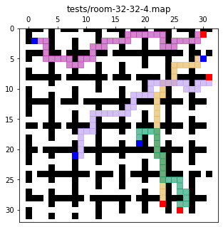
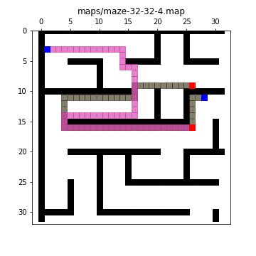
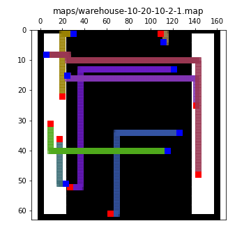

# CBS Basics and enhancements
## Conflict-Based Search Algorithms for Multi-Agent Pathfinding problem


## Description

A software project at the Saint-Petersburg University. 

Multi-Agent Path Finding (MAPF) is a problem of finding a set of paths consisting of motion trajectories for each of the agents, without collisions, where the start and final positions are known for each agent. Practical systems must quickly find conflict-free paths for such agents.

Conflict-Based Search Algorithm (CBS) is a classical method of solving the MAPF problem. It is a two-level algorithm: at the high level, a search is performed on a Conflict
Tree (CT) which is a tree based on conflicts between individual agents. Each node in the CT represents a set of constraints on the motion of the agents. At the low level, fast singleagent searches are performed to satisfy the constraints imposed by the high level CT node.

There are some improvements of CBS:
- `CBS + Disjoint Splitting`: the main idea of this method is that when splitting a node in a CT, the sets of trajectories available to agents in the right and left subtrees can overlap strongly, therefore, in order to avoid repeated calculations, so-called positive constraints are introduced, which oblige the agent to be in a given node or walk along the given edge at the specified time.
- `CBS + High Level Heuristics`: in this version of the algorithm improvement, heuristics are considered at the upper level CT
- `CBS + Bypassing Conflicts`: when a conflict is found, we first attempt to bypass the conflict and avoid the need to perform a split and add new constraints. If no bypass is found we resort to the drastic split action of adding explicit constraints to avoid the conflict.
- `CBS + Prioritising Conflicts`: we distinguish between three types of conflicts and show that prioritizing them may immediately increase the solution cost in the sub-tree below the current node thereby significantly reducing the size of the CT
- `CBS + MetaAgents`:  the improvements are based on merging agents into a meta-agent
 


## Installing

Download current repository to your local machine. Use

```bash
git clone https://github.com/PolinaKlimenko/CBS.git
```

The project requires submodules, to install them use

```bash
cd CBS
git submodule init
git submodule update
```
## Files

- `MAPF.py` - file contains class `Map`, that represents the environment for agents; `read_map_from_movingai_file function`, that draw map from file; `read_tasks_from_movingai_file` function that read a scenarium
- `CT.py` - file describes Nodes of Tree
- `cbs.py` - cbs algorithm
- `Improvements.py` - bypassing cbs, prioritising conflicts algorithm
- `ma-cbs.py` - meta-agent cbs algorithm
- `CBS_test` - performing tests for all the algorithms above


## Usage

Run all cells in ```CBS.ipynb```. You may change test parameters in the last cell:
1) maximum number of agents (default=8)
2) minimum number of agents (default=2)
3) number of agents increase step (default=3)
4) MA-CBS merge border (default=3)
5) list of performed tests

## Input data

To test the algorithms,  we used [open test library](https://movingai.com/) (specifically, its section is devoted to testing algorithms for MAPF).

We chose 5 different types of cards:
- `Empty`
- `Random inspections`
- `Labyrinth`
- `Room`

## Output images







## Sources
- Guni Sharon, Roni Stern, Ariel Felner, Nathan R. Sturtevant; Conflict-based search for optimal multi-agent pathfinding. [**URL**](https://www.bgu.ac.il/~felner/2015/CBSjur.pdf)

- Eli Boyarski, Ariel Felner, Roni Stern, Guni Sharon, David Tolpin, Oded Betzalel, Eyal Shimony; ICBS: Improved Conflict-Based Search Algorithm for Multi-Agent Pathfinding; Proceedings of the Twenty-Fourth International Joint Conference on Artificial Intelligence (IJCAI 2015), [**URL**](https://www.ijcai.org/Proceedings/15/Papers/110.pdf)
		
- Eli Boyarski, Ariel Felner, Guni Sharon, Roni Stern; Don't Split, Try To Work It Out: Bypassing Conflicts in Multi-Agent Pathfinding; Proceedings of the Twenty-Fifth International Conference on Automated Planning and Scheduling, [**URL**](https://ojs.aaai.org/index.php/ICAPS/article/view/13725)
- Raz Nissim, Ronen Brafman; Multi-Agent A* for Parallel and Distributed Systems; [**URL**](http://citeseerx.ist.psu.edu/viewdoc/download?doi=10.1.1.365.7765&rep=rep1&type=pdf)
- Jiaoyang Li, Ariel Felner, Eli Boyarski, Hang Ma, Sven Koenig; Improved Heuristics for Multi-Agent Path Finding with Conflict-Based Search; [**URL**](https://www2.cs.sfu.ca/~hangma/pub/ijcai19.pdf)
- Jiaoyang Li, Daniel HaraborPeter, J. Stuckey, Ariel Felner, Hang Ma, Sven Koenig; Proceedings of the Twenty-Ninth International Conference on Automated Planning and Scheduling (ICAPS 2019); [**URL**](https://ojs.aaai.org/index.php/ICAPS/article/view/3487/3355)

## Mentors

Yakovlev Konstantin Sergeevich

- kyakovlev@hse.ru
- [HSE website](https://www.hse.ru/staff/yakovlev-ks)
- Telegram: @KonstantinYakovlev

## Contacts

Kazovskaya Anastasia

- Telegram: @Chickypicky

Klimenko Polina

- Telegram: @polinko13

Shulzhenko Alexander

- Telegram: @amoskowski
